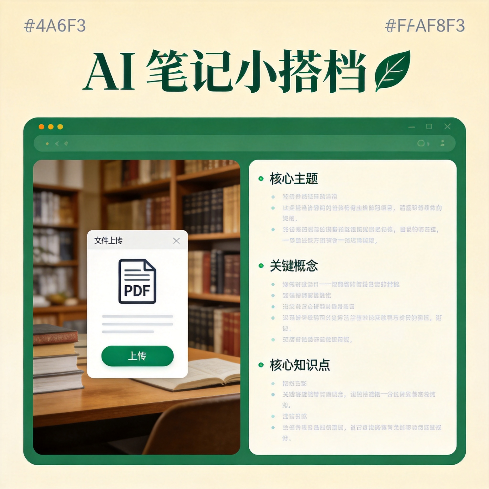

# AI 笔记小搭档

> 大学生期末复习神器 - 上传 PDF 课件，AI 自动生成精简学习笔记

[](https://creativecommons.org/licenses/by-nc/4.0/)
[](https://nextjs.org/)
[](https://react.dev/)
[](https://www.typescriptlang.org/)

## 项目简介

AI 笔记小搭档是一个面向大学生的期末复习辅助工具。上传 PDF 课件或粘贴文本内容，AI 会自动提取核心知识点，生成结构清晰、重点突出的学习笔记，帮助你高效复习。

**核心理念**：精简 > 冗长。笔记只保留最关键的考点和概念，不堆砌废话。

## 效果预览



## 功能特点

- **PDF 智能解析** - 上传 PDF 课件，自动提取文本内容
- **纯文本支持** - 也可以直接粘贴文本进行整理
- **三种笔记模式**：
  - 大纲梳理 - 提取章节结构和知识框架
  - 重点总结 - 归纳核心考点和要点（推荐）
  - 问答生成 - 生成复习自测问答
- **流式输出** - 打字机效果实时展示生成过程
- **PDF 下载** - 生成的笔记可一键导出为 PDF 文件
- **一键复制** - 纯文本格式，粘贴到 Word/Notion 无格式问题
- **响应式设计** - 手机、平板、电脑都能用

## 技术栈

| 技术 | 用途 |
|------|------|
| Next.js 16 (App Router) | 全栈框架 |
| React 19 | 前端 UI |
| TypeScript 5 | 类型安全 |
| Tailwind CSS 4 | 样式 |
| shadcn/ui | 组件库 |
| coze-coding-dev-sdk | LLM 大模型调用 |
| unpdf | PDF 文本提取 |
| jsPDF + html2canvas | PDF 导出 |
| react-markdown | 笔记渲染 |

## 快速开始

### 环境要求

- Node.js 18+
- pnpm

### 安装步骤

```bash
# 克隆项目
git clone https://github.com/your-username/ai-note-buddy.git
cd ai-note-buddy

# 安装依赖
pnpm install

# 启动开发服务器
pnpm dev

# 构建生产版本
pnpm build

# 启动生产服务
pnpm start
```

## 项目结构

```
ai-note-buddy/
├── src/
│   ├── app/
│   │   ├── layout.tsx              # 全局布局
│   │   ├── page.tsx                # 首页（上传 + 笔记展示）
│   │   ├── globals.css             # 全局样式
│   │   └── api/
│   │       ├── generate/route.ts   # 核心 API：PDF 解析 + LLM 笔记生成
│   │       └── health/route.ts     # 健康检查
│   ├── components/ui/              # shadcn/ui 组件
│   └── lib/utils.ts                # 工具函数
├── docs/                           # 文档和截图
├── DESIGN.md                       # 设计规范
├── AGENTS.md                       # 开发规范
└── package.json
```

## 使用场景

- 期末复习：上传老师发的 PPT/PDF 课件，快速生成复习笔记
- 读书笔记：整理教材章节的重点内容
- 会议记录：粘贴会议文本，提取关键决策和待办事项
- 论文阅读：快速提取论文核心观点

## 许可证

本项目采用 [CC BY-NC 4.0](https://creativecommons.org/licenses/by-nc/4.0/) 许可协议。

**允许**：
- 学习、研究、交流使用
- 非商业目的的个人使用
- 在注明出处的前提下分享和改编

**禁止**：
- 任何形式的商业用途
- 将本项目用于盈利目的
- 将本项目作为商业产品的一部分

如需商业授权，请联系项目作者。

## 免责声明

本项目仅供学习交流使用。AI 生成的笔记内容可能存在不准确之处，请以原始资料为准。使用者需自行判断笔记内容的准确性，作者不对因使用本项目产生的任何损失负责。

## 贡献

欢迎提交 Issue 和 Pull Request！

## 作者

本项目由大学生开发，旨在帮助同学们更高效地复习备考。
